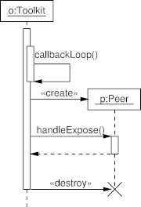

umlsequence
===========

UML Sequence Diagrams Generator - Commandline tool to generate images from UMLGraph text files.

The [umlgraph](http://www.umlgraph.org/ "UMLGraph") utility allows you
to generate class and sequence diagrams in a non-interactive way, by
means of a description in a text file.

UMLGraph defines an imperative domain-specific language (DSL).

umlsequence is a layer above UMLGraph, providing an alternative syntax
which is more compact.

The following example illustrates the difference.

UMLGraph syntax:

    # Define the objects
    object(O,"o:Toolkit");
    placeholder_object(P);
    step();
    
    # Activation and messages
    active(O);
    message(O,O,"callbackLoop()");
    create_message(O,P,"p:Peer");
    message(O,P,"handleExpose()");
    active(P);
    return_message(P,O,"");
    inactive(P);
    destroy_message(O,P);
    inactive(O);
    
    # Complete the lifeline of O
    step();
    complete(O);

Same, in umlsequence syntax:

    # Define the objects
    O  : o:Toolkit
    P  :
    
    # Activation and messages
    O+
    :
    O          > callbackLoop()
    
    O  ::>  P  p:Peer
    O  ==>  P  =handleExpose()
    O- ##>  P

The two yield exactly the same image:



Syntax and Examples
-------------------

See http://ten.homelinux.net/productivity/doc/CASE%20Tools/UML%20Modeling/Sequence%20Diagram

Dependencies
------------

 * python-setuptools (for setup -- for building the Debian package)
 * imagemagick (for convert)
 * plotutils (for pic2plot)

Installing via Debian package
-----------------------------

 1. Install dependencies:
        ```
        sudo apt install python-setuptools imagemagick plotutils
        ```


 1. run:
        ```
        ./build_debian.sh
        ```

 1. run:
        ```
        sudo dpkg -i ./deb_dist/python-umlsequence_1.00.unknown-revision-1_all.deb
        ```

Installing manually (Linux and OSX)
-----------------------------------

 1. Make sure that ``imagemagick`` and ``plotutils`` are installed.

 1. Copy the **directory** umlsequence to an appropriate place:

        sudo cp -a umlsequence/ /usr/local/

 1. Make a symlink into a directory included in the PATH (for instance `/usr/local/bin/`):

        sudo ln -s /usr/local/umlsequence/umlsequence /usr/local/bin/

Usage
-----

`umlsequence -h` says:

    usage: umlsequence [-h] [--version] [--output-file OUTPUT_FILE]
                       [--percent-zoom PERCENT_ZOOM]
                       [--background-color BACKGROUND_COLOR] [--debug]
                       [--format FORMAT]
                       [INPUT_FILE]
    
    UML sequence command-line utility. (C) Copyright 2012 by Pascal Bauermeister.
    Converts a textual UML sequence description into a PNG bitmap. See
    http://ten.homelinux.net/productivity/doc/UmlSequence for syntax description
    and examples.
    
    positional arguments:
      INPUT_FILE            UML sequence input file; if omitted, stdin is used
    
    optional arguments:
      -h, --help            show this help message and exit
      --version, -v         show program's version number and exit
      --output-file OUTPUT_FILE, -o OUTPUT_FILE
                            output file name; pass '-' to force to stdout; if
                            omitted, use INPUT_FILE base name or stdout
      --percent-zoom PERCENT_ZOOM, -p PERCENT_ZOOM
                            magnification percentage; default is 100
      --background-color BACKGROUND_COLOR, -b BACKGROUND_COLOR
                            background color name (including 'transparent'); see h
                            ttp://www.imagemagick.org/script/color.php#color_names
                            for a list of valid names; default is white
      --debug               emits debug messages
      --format FORMAT, -f FORMAT
                            output format: any supported by ImageMagick; default
                            is ps
